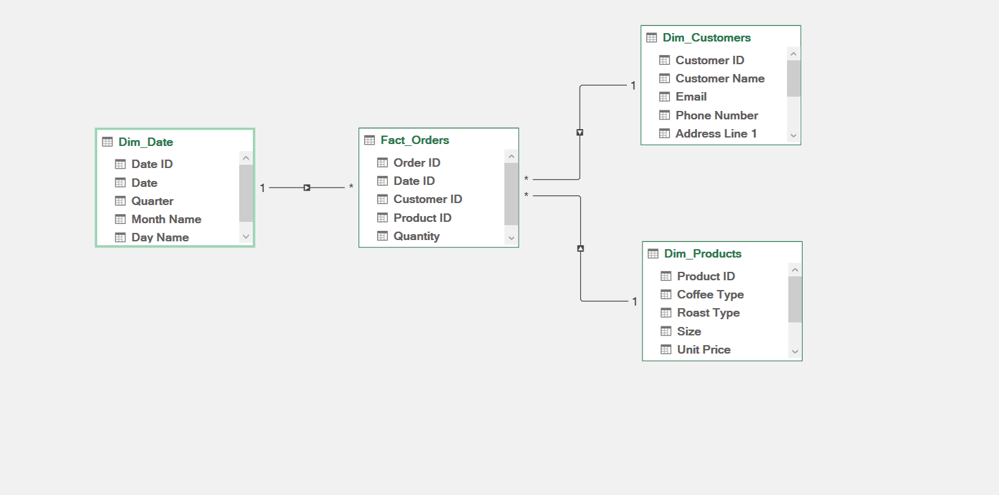
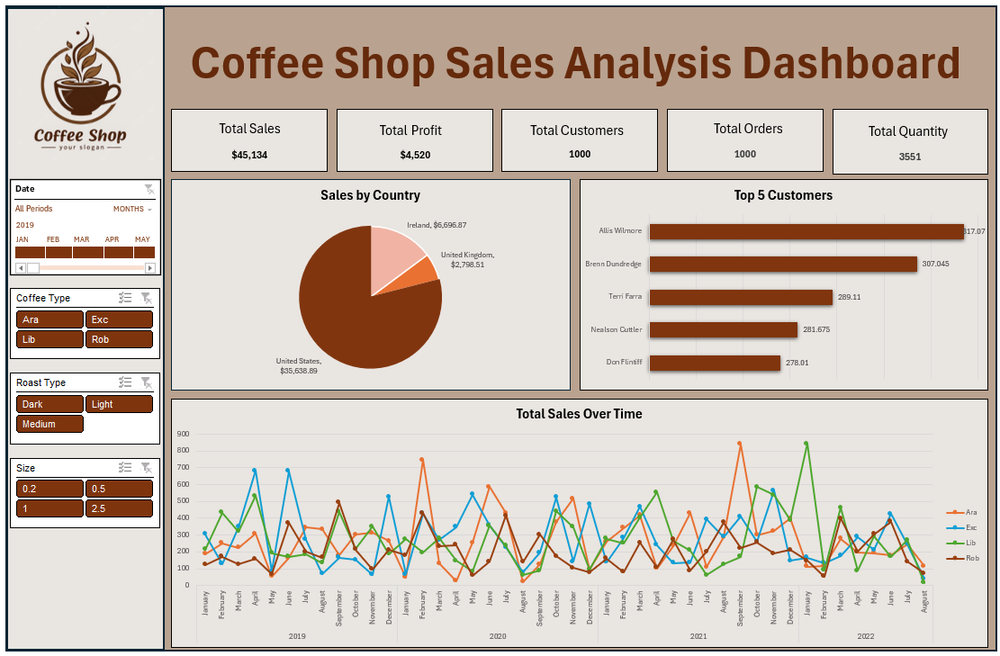

# ☕ Coffee Sales Analysis Dashboard

## 📌 Project Overview
This project analyzes coffee sales data using Excel to uncover insights about sales performance, customer behavior, and product trends.

---

## 🛠 Tools Used
- Excel
- Power Query (Data Cleaning & Transformation)
- Pivot Tables
- Data Modeling (Star Schema)
- Dashboard Design

---

## 🧹 Data Preparation
- Imported data using Power Query
- Cleaned and transformed the dataset
- Created a Fact Table: `Fact_Orders`
- Created Dimension Tables:
  - `Dim_Customers`
  - `Dim_Products`
  - `Dim_Date` (custom created)

---

## 🧩 Data Model
A **Star Schema** was used to structure the data.

---

## 📊 Dashboard Features

### Filters
- Date
- Coffee Type
- Roast Type
- Size

### KPIs
- Total Sales
- Total Profit
- Total Customers
- Total Orders
- Total Quantity

### Visualizations
- Sales by Country
- Top 5 Customers
- Sales Over Time

---

## 🔍 Key Insights

- Sales show seasonal trends with peak periods.
- A small number of customers generate a large portion of revenue.
- Certain coffee types and roast levels dominate sales.
- Some countries significantly outperform others.
- Profit does not always scale with sales, indicating cost considerations.

---

## 💡 Business Recommendations

- Focus on high-performing products and markets.
- Retain top customers with targeted offers.
- Optimize pricing and cost structure.
- Increase marketing during low-demand periods.

---

## 📎 Conclusion
This dashboard helps stakeholders make data-driven decisions by providing a clear view of performance across products, customers, and regions.
